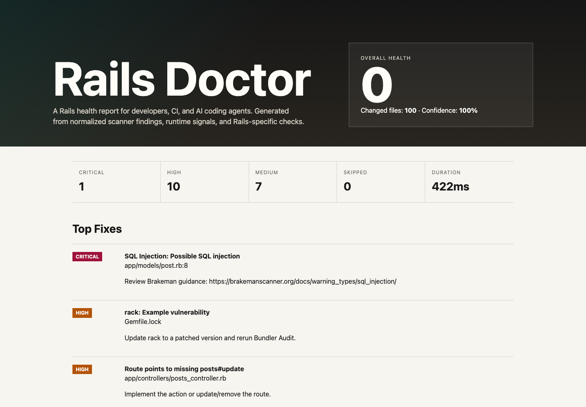

# Rails Doctor

Rails Doctor is a Rails health scanner for developers, CI, and AI coding agents.

It runs trusted Ruby/Rails tools, adds Rails-specific checks, and turns the results into one normalized report for humans and agents. The goal is simple: keep fast-moving AI-assisted Rails work from quietly accumulating technical debt.



## Quickstart

```sh
gem install rails-doctor
rails-doctor
```

For a project setup pass:

```sh
rails-doctor init --dry-run --ci
rails-doctor init --yes --ci
```

Generate reports:

```sh
rails-doctor --format json --output tmp/rails-doctor/report.json
rails-doctor --format markdown --output tmp/rails-doctor/summary.md
rails-doctor --format html --output tmp/rails-doctor/report.html
```

Hand high-severity findings to an agent explicitly:

```sh
rails-doctor agent codex --severity high
rails-doctor agent codex --severity high --apply
```

Normal scans never mutate your repo. Agent execution requires an explicit `agent` command and `--apply`.

## What It Checks

Rails Doctor delegates to mature tools where they already do the job well:

- RuboCop and RuboCop Rails for lint/style/correctness
- Brakeman for Rails security
- Bundler Audit for vulnerable dependencies
- `rails zeitwerk:check` for autoloading
- Reek for code smells
- Flog for complexity
- Flay for duplication
- Strong Migrations for migration safety coverage
- Bullet or Prosopite signals captured through the configured test command

Rails Doctor-owned checks focus on Rails-specific gaps and synthesis:

- missing indexes on foreign keys
- uniqueness validations without unique DB indexes
- route/controller/action/view consistency
- conservative dead route/action/view hints
- large Rails artifact hotspots
- TODO/FIXME/HACK density
- missing test/spec counterparts for changed app files
- churn + quality hotspot scoring
- skipped-tool coverage gaps

## Output Formats

The default terminal report is concise and human-readable.

`--format json` is the stable public contract for agents. It includes summary data, findings, tool runs, scores, skipped tools, hotspots, metadata, fix guidance, and direct `agent_instruction` fields.

`--format markdown` is optimized for pull request comments and GitHub Actions summaries.

`--format html` produces a static self-contained dashboard with score, confidence, top fixes, filters, hotspots, agent brief, skipped tools, and raw tool output.

## Profiles

- `fast`: static/local only, no tests, no network
- `recommended`: core static checks and configured local coverage
- `ci`: static checks, tests, runtime warnings, and artifacts
- `deep`: CI plus deep quality, dependency freshness, and hotspot detail

## GitHub Actions

`rails-doctor init --ci` can generate a workflow that runs Rails Doctor on pull requests, writes a Markdown job summary, and uploads JSON/Markdown/HTML artifacts.

You can gate PRs:

```sh
rails-doctor --profile ci --fail-on critical
rails-doctor --profile ci --min-score 80
```

## Supported Versions

Rails Doctor targets modern Rails apps:

- Ruby `>= 3.2`
- Rails `>= 7.1`
- First-class Rails 8 support

The project test matrix covers Ruby 3.2, 3.3, and 3.4 against Rails 7.1, 7.2, and 8.x fixture scenarios where practical.

## Documentation

- [CLI reference](docs/cli-reference.md)
- [Configuration reference](docs/config-reference.md)
- [Output schema](docs/output-schema.md)
- [Scoring model](docs/scoring-model.md)
- [Adapter architecture](docs/adapter-architecture.md)
- [Architecture diagram](docs/architecture.md)
- [Agent handoff](docs/agent-handoff.md)
- [Contributing](CONTRIBUTING.md)

## Monetization Posture

Rails Doctor CLI is MIT-licensed and fully useful as open source. Future paid value belongs above the CLI: hosted report history, team policy management, GitHub App checks, org-wide trends, and agent remediation queues.
