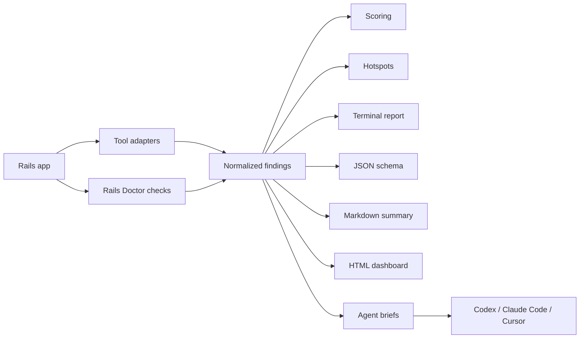

# Architecture

```mermaid
flowchart LR
  A[Rails app] --> B[Tool adapters]
  A --> C[Rails Doctor checks]
  B --> D[Normalized findings]
  C --> D
  D --> E[Scoring]
  D --> F[Hotspots]
  D --> G[Terminal report]
  D --> H[JSON schema]
  D --> I[Markdown summary]
  D --> J[HTML dashboard]
  D --> K[Agent briefs]
  K --> L[Codex / Claude Code / Cursor]
```

Adapters run mature tools and normalize their output. Rails Doctor-owned checks fill gaps, then every output format renders from the same findings model.
